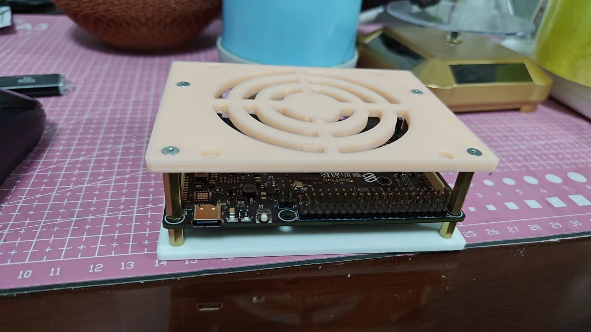
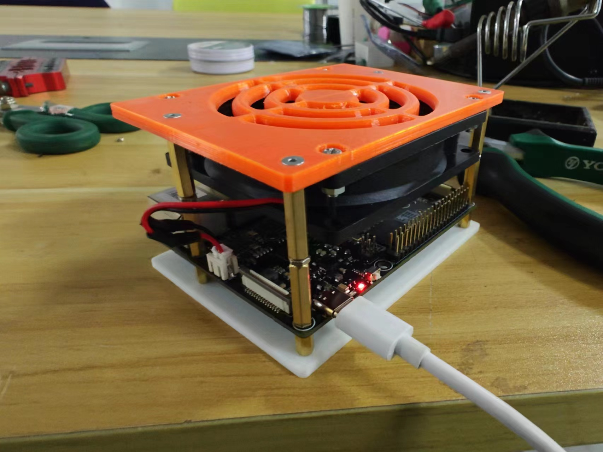

## 赛昉星光2 单板计算机3D打印开放外壳

板子尺寸 100 × 74 mm
### 资料

https://forum.rvspace.org/t/any-mechanical-description-of-the-board/1198/3
### 设计主要参考这个方案,感谢大佬

https://shop.truecontrol.org/index.php?route=product/product&path=77&product_id=110
### 其他打印外壳

https://www.printables.com/model/360115
https://github.com/leipopo/kekeandzuozuo4rock5b

### 官方文档

过孔主要分为两种：
1、沉铜孔PTH（Plating Through Hole），孔壁有铜，一般是过电孔（VIA PAD）及元件孔（DIP PAD）。
2、非沉铜孔NPTH(Non Plating Through Hole)，孔壁无铜，一般是定位孔及螺丝孔。

成品大小
106mm long
80mm wide
36mm or 58mm tall

## 图片

## 物料

参考发货单赛昉星光2开放外壳发货单
https://docs.qq.com/sheet/DZmJWdmpBS1hlY2dh?tab=BB08J2

